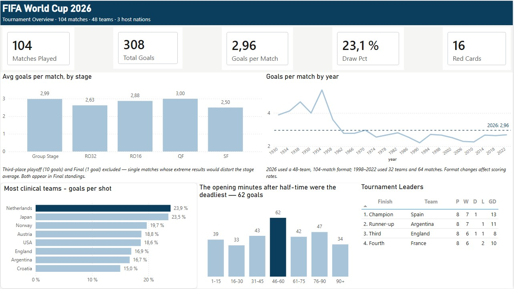
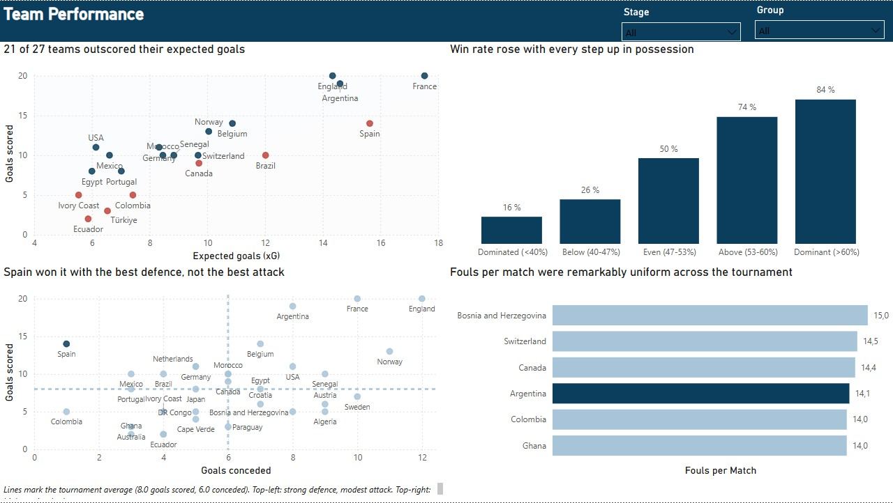
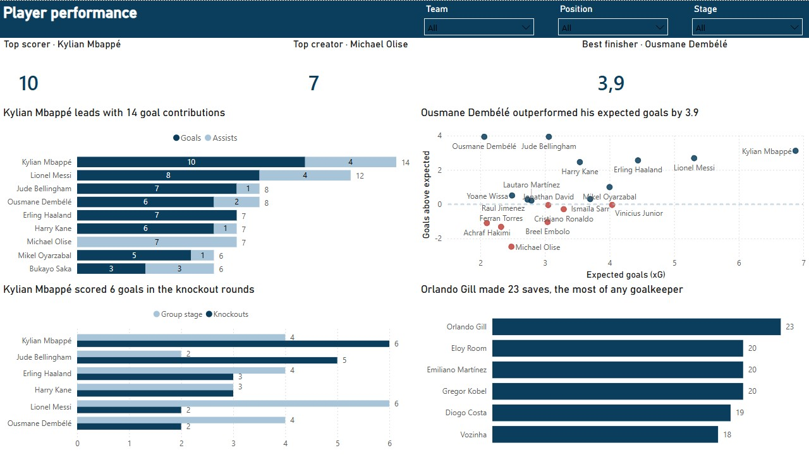

# FIFA World Cup 2026 — End-to-End Analytics Pipeline

An end-to-end data project: raw CSVs → PostgreSQL star schema → Power BI dashboard.
Built to answer questions about the tournament, not to display every available metric.

**Stack:** PostgreSQL 15 · Power BI Desktop · DAX · Python (pandas, profiling only)

---

## Key findings

**2026 was the highest-scoring World Cup since 1970.** 308 goals in 104 matches — 2.96 per
match, against 2.54 for the 32-team era (1998–2022) and 2.82 all-time. The last tournament
to reach that rate was Mexico 1970 (2.97). *Caveat: the expansion from 32 to 48 teams
changes the competitive distribution, so this is not a like-for-like comparison.*

**Spain won it with the best defence, not the best attack.** 14 goals scored across 8
matches — mid-table — but only 1 conceded. Every other team in the top four conceded at
least 8.

**Possession translated into results more strongly than expected.** Teams holding over 60%
of the ball won 84% of decided matches; teams under 40% won 16%. The gradient is monotonic
across all five possession bands.

**The most dangerous period was the restart, not the finish.** 62 goals fell between minutes
46 and 60 — 44% above the average 15-minute window, and more than the 76–90 band.

**Michael Olise was the tournament's purest creator — and its worst finisher.** 7 assists
(most of any player) with 0 goals from 2.5 expected goals: the largest negative finishing
delta in the dataset. Volume metrics alone would have ranked him alongside pure goalscorers.

---

## Repository structure

```
sql/
  01_schema.sql       DDL. Table definitions and type decisions.
  02_transform.sql    Name normalisation, data fixes, modelled views.
  03_star_schema.sql  Star schema views published to Power BI.
  04_reload.sql       Post-tournament data refresh procedure.
  05_benchmarks.sql   Historical World Cup benchmarks, 1930–2022.

data/                 Source CSVs (10 files).
dashboard/            Power BI file (.pbix) and page exports.
```

---

## Data model

Ten source tables reduced to a six-object star schema. Only these are published to Power BI:

| Object | Grain | Rows |
|---|---|---|
| `dim_players` | one row per player | 1,260 |
| `dim_matches` | one row per match | 104 |
| `dim_podium` | final standings | 4 |
| `fact_team_match` | one row per team per match | 208 |
| `fact_player_match` | one row per player per match | 3,288 |
| `fact_goals` | one row per goal | 308 |

Nine relationships, all one-to-many, single direction. Auto-detection was disabled and each
relationship created manually.

**Modelling decisions worth noting:**

`dim_matches` deliberately excludes `home_team`, `away_team` and `winner`. Each would create
a second filter path to the team dimension and force Power BI to deactivate relationships.
That information lives in `fact_team_match` instead, as `team` / `opponent` / `advanced`.

`match_stats` shares its grain exactly with the team-match fact, so it is merged in rather
than kept separate. Power BI cannot build relationships on composite keys, and two tables at
the same grain would be unusable side by side.

`fact_team_match` distinguishes two notions of "result": `outcome` is the result on goals,
`advanced` is who progressed. They differ in the four penalty shootouts.

---

## Data quality issues found and resolved

Six issues, all documented in `02_transform.sql` rather than silently patched.

**1. A goal assigned to the wrong match.** Goal #188 was tagged to match 62 (Senegal 5–0
Iraq) but belongs to match 64 (Uruguay 0–1 Spain), which otherwise recorded zero goals.

**2. Case-duplicated categories.** `goal_type` contained both `Own goal` and `Own Goal`,
`Free kick` and `Free Kick` — which would have split every category in half in any visual.

**3. Inconsistent entity names.** `Metlife Stadium` vs `MetLife Stadium`; `Turkiye` vs
`Türkiye` across files. Left unfixed, these break joins silently and produce NULLs rather
than errors.

**4. A column with mixed types.** `half` contains `1`, `2`, `ET-1`, `ET-2`. Typed as INTEGER
the extra-time rows fail to load; the column is TEXT.

**5. Accented names as the only join key.** Player names are the sole link between four
tables and are inconsistently accented across them (`Julián Quiñones` / `Julian Quinones`).
Resolved with a `nkey()` function using PostgreSQL's `unaccent` extension.

**6. An empty-string key produced by the normalisation function.** `nkey()` coalesces NULL
to an empty string, so a plain `COALESCE(nkey(a.x), nkey(d.x))` in a FULL OUTER JOIN always
resolves to the left side. Defence-only rows received an empty key that matched no player,
which Power BI grouped under `(Blank)`. Fixed with `NULLIF(..., '')` on both sides.

### A modelling error worth documenting

Brazil fielded two players named Ederson: a goalkeeper (32) and a midfielder (26). An early
version of `nkey()` merged them, assuming a name-formatting inconsistency. This collapsed two
real people into one, broke `player_key` uniqueness, and turned every relationship to
`dim_players` into many-to-many.

Power BI caught it — the relationship refused to be created as one-to-many. `nkey()` now
performs accent normalisation only, with no alias logic, and `02_transform.sql` carries an
explicit warning against reintroducing it.

Three player-match rows remain present on only one side of the attack/defence join (both
Edersons in match 31, Tahith Chong in match 35). All metrics on those rows are zero. They are
documented rather than forced out.

---

## Dashboard

**Page 1 — Tournament Overview.** Headline KPIs; average goals per match by stage; goals per
match across all 22 World Cups with a 2026 reference line; shot conversion by team; goal
timing distribution in 15-minute bands; final standings.

**Page 2 — Team Performance.** Finishing quality (goals vs expected goals); win rate by
possession band; goals scored vs conceded with tournament-average quadrants; fouls per match.

**Page 3 — Player Performance.** Goal contributions (goals + assists); goals above expected;
group-stage vs knockout output; goalkeeper saves. Filterable by team, position and stage.

**Design conventions applied throughout:**

Titles state a finding, not an axis. Where a title makes a quantitative claim, it is a DAX
measure so it cannot go stale on reload or contradict an active filter.

Colour carries one meaning: navy marks the subject of the title, light blue is context, red
marks below-expected performance.

Bar and column axes always start at zero. Scatter axes do not, since length encodes nothing
there.

Sample-size caveats are stated, not hidden. The third-place playoff and final are excluded
from the by-stage average as single matches whose results would distort it, and this is
noted on the page.

## Dashboard

### Page 1 — Tournament Overview


### Page 2 — Team Performance


### Page 3 — Player Performance


---
## Reproducing

1. Create a PostgreSQL database and run `01_schema.sql`. Requires the `unaccent` extension.
2. Import the ten CSVs. In pgAdmin: Header ON, encoding UTF8, format CSV.
3. Run `02_transform.sql` block by block. Each section ends with a validation query.
4. Run `03_star_schema.sql`, then `05_benchmarks.sql`.
5. Connect Power BI to PostgreSQL in Import mode. Load only the six star-schema objects plus
   `venues` and `wc_benchmarks`.
6. Disable relationship auto-detection and create the nine relationships manually.

`04_reload.sql` handles refreshing the data without rebuilding the schema. It truncates,
reimports, reapplies every fix, and runs seven integrity checks.

---

## Limitations

The source data has no match dates, only sequential match numbers — no time-series analysis
by calendar date is possible.

`fact_player_match` has no minutes-played column, so per-90 normalisation is unavailable.
Per-match ratios are used instead, which do not distinguish starters from substitutes.

Penalty shootout goals are excluded from `goals` by design. Shootout outcomes are captured
through the `advanced` flag on `fact_team_match`.

Expected goals figures are as supplied by the source and their model is not documented.

---

Source data: [FIFA WORLD CUP 2026 DATASET(All 104 Matches)] via Kaggle — [https://www.kaggle.com/datasets/sahilmo/fifa-world-cup-2026-datasetgroup-stage]
